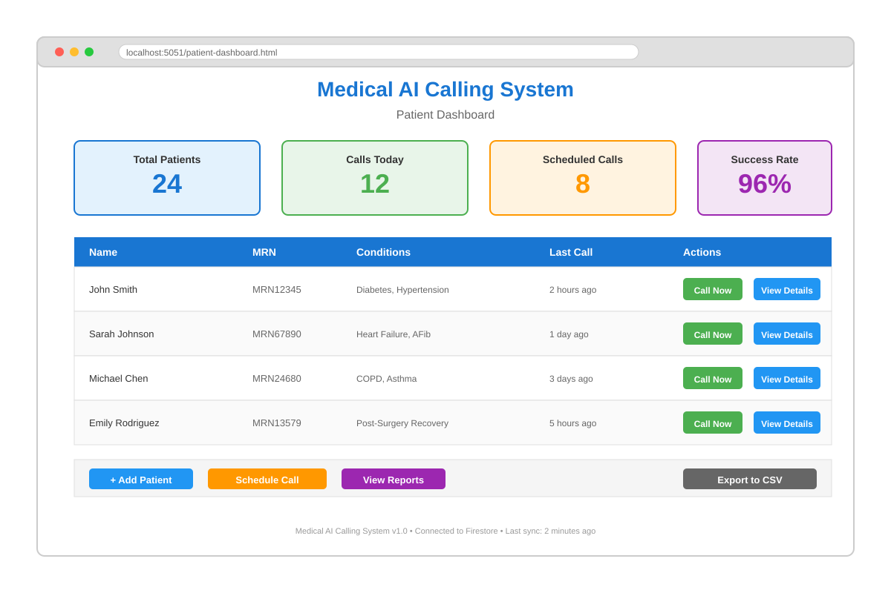

# Medical AI Calling System

<div align="center">


**An intelligent AI-powered calling system for automated patient wellness checks and interactive voice assistance using Twilio, OpenAI's Realtime API, and Google Cloud.**

[Features](#features) • [Architecture](#architecture) • [Quick Start](#quick-start) • [API Documentation](#api-documentation) • [Deployment](#deployment) • [Contributing](#contributing)

</div>

---

## Overview

The Medical AI Calling System is a comprehensive telephony platform that combines the power of OpenAI's GPT-4 Realtime API with Twilio Voice services to create intelligent, HIPAA-conscious voice interactions. The system supports both **inbound** (receive calls) and **outbound** (make calls) scenarios, with specialized features for medical wellness checks, patient management, and automated scheduling.

### Key Capabilities

- **Bi-directional Voice AI**: Handle incoming calls and place outbound calls with natural AI conversation
- **Real-time Audio Processing**: Low-latency audio streaming between Twilio and OpenAI
- **Patient Management**: Full CRUD operations for patient records with MRN tracking
- **Call Transcription**: Automatic transcription and storage of all call conversations
- **Webhook Notifications**: Real-time updates via webhooks for call events and transcripts
- **Scheduled Wellness Checks**: Automated recurring calls for patient monitoring
- **Cloud-Native**: Deploy to Google Cloud Run with Firestore backend
- **Comprehensive Testing**: Full E2E test suite with Playwright

---

## Screenshots

<div align="center">

### Patient Dashboard

*Web-based patient management interface with real-time statistics*

</div>

---

## Features

### Inbound System (Port 5050)

The inbound system allows people to call **your** number and interact with an AI assistant.

- Voice AI assistant powered by OpenAI's Realtime API
- Natural language understanding and response
- Interrupt handling and conversation management
- Customizable AI personality and instructions
- TwiML webhook integration

### Outbound Medical System (Port 5051)

The outbound system makes calls **to patients** for automated wellness checks and follow-ups.

- **Patient Dashboard**: Web-based UI for managing patients and calls
- **Personalized AI Prompts**: Custom conversation objectives per patient
- **Medical Record Numbers (MRN)**: Track patients with unique identifiers
- **Call History**: Complete audit trail of all calls and outcomes
- **Transcription System**: Full conversation transcripts with speaker identification
- **Scheduled Calls**: One-time and recurring call scheduling
- **Webhook Integration**: POST call data to external systems
- **REST API**: Full programmatic access to all features

---

## Architecture

<div align="center">


</div>

### System Flow

1. **Patient/User** initiates or receives a phone call
2. **Twilio Voice** handles inbound webhooks and outbound dialing via Media Streams
3. **Fastify Server** orchestrates WebSocket connections, manages audio buffering, and handles conversation state
4. **OpenAI Realtime API** processes audio in real-time: Speech-to-Text → GPT-4 Conversation → Text-to-Speech
5. **Firestore/File System** stores patient data, call transcripts, audit logs, and scheduled calls

### Technology Stack

| Component | Technology |
|-----------|-----------|
| **Runtime** | Node.js 18+ |
| **Web Framework** | Fastify |
| **Voice/SMS** | Twilio Voice & Media Streams |
| **AI Engine** | OpenAI GPT-4 Realtime API |
| **Database** | Firebase Firestore (production) / JSON (dev) |
| **Deployment** | Google Cloud Run |
| **Testing** | Playwright |
| **Scheduling** | node-cron |

---

## Quick Start

### Prerequisites

- **Node.js 18+** ([download](https://nodejs.org/))
- **Twilio Account** with a phone number ([sign up](https://www.twilio.com/try-twilio))
- **OpenAI API Key** with Realtime API access ([sign up](https://platform.openai.com/))
- **ngrok** or similar tunneling tool ([download](https://ngrok.com/))
- **Firebase Project** (optional, for Firestore) ([console](https://console.firebase.google.com/))

### Installation

```bash
# Clone the repository
git clone https://github.com/jeffbander/Basic-gpt40-agent.git
cd Basic-gpt40-agent

# Install dependencies
npm install

# Create environment file
cp .env.example .env
```

### Configure Environment Variables

Edit `.env` with your credentials:

```env
# OpenAI
OPENAI_API_KEY=sk-your-openai-api-key

# Twilio
TWILIO_ACCOUNT_SID=ACxxxxxxxxxxxxx
TWILIO_AUTH_TOKEN=your-auth-token
TWILIO_PHONE_NUMBER=+1234567890

# Server
BASE_URL=https://your-ngrok-url.ngrok.app
PORT=5051

# Firebase (optional)
USE_FIRESTORE=true
FIREBASE_SERVICE_ACCOUNT_JSON={"type":"service_account",...}
```

### Start ngrok Tunnel

```bash
# Terminal 1: Start ngrok
ngrok http 5050  # For inbound system
ngrok http 5051  # For outbound system
```

Copy the ngrok URL and update your `.env` file's `BASE_URL`.

### Run the Application

```bash
# Start inbound system (receives calls)
npm run start:inbound

# OR start outbound medical system (makes calls)
npm run start:medical

# OR start both simultaneously in different terminals
```

### Access the Dashboard

Open your browser to:
- **Patient Dashboard**: http://localhost:5051/patient-dashboard.html
- **Call Management**: http://localhost:5051/call-management.html

### Make Your First Call

#### Inbound Test
1. Configure your Twilio number webhook to: `https://your-ngrok-url.ngrok.app/incoming-call`
2. Call your Twilio number
3. Talk to the AI assistant!

#### Outbound Test
1. Update patient phone numbers in `patients-v2.json`
2. Open the patient dashboard
3. Select a patient and click "Call Now"
4. The AI will call the patient and conduct a wellness check

---

## API Documentation

### Patient Management

#### Create Patient
```bash
POST /api/patients
Content-Type: application/json

{
  "name": "John Doe",
  "phone": "+1234567890",
  "mrn": "MRN001",
  "conditions": ["Diabetes", "Hypertension"],
  "medications": ["Metformin", "Lisinopril"],
  "callObjectives": [
    "Check blood glucose levels",
    "Verify medication adherence"
  ]
}
```

#### Get All Patients
```bash
GET /api/patients
```

#### Get Patient by ID
```bash
GET /api/patients/:patientId
```

#### Update Patient
```bash
PUT /api/patients/:patientId
Content-Type: application/json

{
  "phone": "+1987654321",
  "notes": "Updated contact number"
}
```

### Call Management

#### Initiate Call
```bash
POST /api/call
Content-Type: application/json

{
  "patientId": "patient-001",
  "priority": "high"
}
```

#### Schedule Call
```bash
POST /api/schedule
Content-Type: application/json

{
  "patientId": "patient-001",
  "scheduledTime": "2025-10-15T10:00:00Z",
  "recurring": true,
  "frequency": "daily"
}
```

#### Get Call History
```bash
GET /api/calls/:patientId
```

#### Get Call Transcript
```bash
GET /api/transcripts/:callSid
```

### Webhooks

#### Register Webhook
```bash
POST /api/webhooks/register
Content-Type: application/json

{
  "url": "https://your-server.com/webhook",
  "events": ["call.completed", "transcript.ready"],
  "secret": "your-webhook-secret"
}
```

#### Webhook Payload Example
```json
{
  "event": "call.completed",
  "timestamp": "2025-10-13T15:30:00Z",
  "data": {
    "callSid": "CA1234567890",
    "patientId": "patient-001",
    "duration": 180,
    "status": "completed",
    "transcript": "Full conversation transcript...",
    "summary": "Patient reported feeling well..."
  },
  "signature": "sha256-hash-for-verification"
}
```

For complete API documentation, see [WEBHOOK_API.md](./WEBHOOK_API.md).

---

## Deployment

### Local Development

See [QUICK_START.md](./QUICK_START.md) for detailed local setup instructions.

### Google Cloud Run (Recommended)

Deploy to Google Cloud Run for production use:

```bash
# Install Google Cloud CLI
# See: https://cloud.google.com/sdk/docs/install

# Authenticate
gcloud auth login
gcloud config set project your-project-id

# Deploy
gcloud run deploy medical-ai-calling-system \
  --source . \
  --region us-east1 \
  --allow-unauthenticated \
  --port 5051
```

Full deployment guide: [GOOGLE_CLOUD_DEPLOYMENT.md](./GOOGLE_CLOUD_DEPLOYMENT.md)

### Environment Variables for Production

Store secrets in Google Cloud Secret Manager:

```bash
# Create secrets
echo -n "your-openai-key" | gcloud secrets create openai-api-key --data-file=-
echo -n "your-twilio-sid" | gcloud secrets create twilio-account-sid --data-file=-
echo -n "your-twilio-token" | gcloud secrets create twilio-auth-token --data-file=-
```

---

## Testing

The project includes comprehensive E2E tests using Playwright.

```bash
# Run all tests
npm test

# Run specific test suite
npm run test:call          # Test call functionality
npm run test:audio-all     # Test audio processing
npm run test:e2e-calls     # Test end-to-end call flows

# Run tests in headed mode (see browser)
npm run test:headed
```

Test coverage includes:
- Audio streaming and buffering
- WebSocket communication
- Call state management
- Transcript generation
- Patient CRUD operations
- Webhook delivery

---

## Project Structure

```
Basic-gpt40-agent/
├── index.js                          # Inbound call server
├── outbound-medical.js               # Outbound call server (v1)
├── outbound-medical-v2.js            # Outbound call server (v2 - current)
├── patients-v2.json                  # Patient database (dev mode)
├── package.json                      # Dependencies and scripts
├── .env                              # Environment configuration
├── Dockerfile                        # Container configuration
├── cloudbuild.yaml                   # Google Cloud Build config
├── playwright.config.js              # Test configuration
│
├── tests/                            # Test suite
│   ├── medical-call-test.spec.js     # Call flow tests
│   ├── twilio-audio-full.spec.js     # Audio processing tests
│   ├── e2e-call-flows.spec.js        # E2E scenarios
│   └── edge-cases.spec.js            # Edge case handling
│
├── public/                           # Static assets
│   ├── patient-dashboard.html        # Patient management UI
│   └── call-management.html          # Call control UI
│
└── docs/                             # Documentation
    ├── QUICK_START.md                # Quick start guide
    ├── DEPLOYMENT.md                 # Deployment instructions
    ├── GOOGLE_CLOUD_DEPLOYMENT.md    # GCP deployment guide
    ├── WEBHOOK_API.md                # Webhook documentation
    ├── TECHNICAL_SPECIFICATION.md    # Technical details
    └── FIREBASE_SETUP.md             # Firebase configuration
```

---

## Configuration

### Patient Configuration

Customize patient-specific AI behavior in `patients-v2.json`:

```json
{
  "id": "patient-001",
  "name": "Jane Doe",
  "mrn": "MRN12345",
  "phone": "+1234567890",
  "conditions": ["Heart Failure", "AFib"],
  "medications": ["Metoprolol", "Warfarin"],
  "callObjectives": [
    "Check if patient is experiencing shortness of breath",
    "Verify medication compliance",
    "Ask about any swelling in legs or feet",
    "Schedule follow-up if symptoms worsen"
  ],
  "aiInstructions": "Be empathetic and thorough. If patient reports worsening symptoms, recommend immediate medical attention."
}
```

### AI Voice Configuration

Modify AI behavior in `outbound-medical-v2.js`:

```javascript
const VOICE = 'alloy';  // Options: alloy, echo, fable, onyx, nova, shimmer
const TEMPERATURE = 0.6; // 0.0 (focused) to 1.0 (creative)
```

---

## Features in Detail

### Real-time Transcription

Every call is automatically transcribed with speaker identification:

```json
{
  "callSid": "CA1234567890",
  "transcript": [
    {
      "speaker": "AI",
      "text": "Hi John, this is your wellness check call. How are you feeling today?",
      "timestamp": "2025-10-13T10:00:05Z"
    },
    {
      "speaker": "Patient",
      "text": "I'm doing pretty well, thanks for asking.",
      "timestamp": "2025-10-13T10:00:12Z"
    }
  ],
  "summary": "Patient reported feeling well. No new symptoms.",
  "sentiment": "positive",
  "flaggedIssues": []
}
```

### Interrupt Handling

The system intelligently handles conversation interruptions:
- Detects when patient starts speaking
- Clears audio buffer to prevent overlapping speech
- Truncates AI response gracefully
- Resumes natural conversation flow

### Webhook Notifications

Real-time updates via webhooks for:
- Call initiated
- Call in progress
- Call completed
- Transcript ready
- Error occurred

### Scheduled Wellness Checks

Automate recurring patient calls:

```javascript
// Schedule daily wellness check at 10 AM
{
  "patientId": "patient-001",
  "frequency": "daily",
  "time": "10:00",
  "timezone": "America/New_York",
  "enabled": true
}
```

---

## Security Considerations

- All API keys stored in environment variables or Secret Manager
- Webhook signatures for verification
- HTTPS enforced in production
- Firestore security rules for data protection
- No PHI logged to console in production
- Call recordings encrypted at rest

**Important**: This is a demo system. For HIPAA compliance, implement:
- BAA with Twilio and OpenAI
- Enhanced access controls
- Audit logging
- Data encryption
- Backup procedures

---

## Troubleshooting

### Common Issues

**Cannot make outbound calls**
```bash
# Verify Twilio credentials
curl -X GET "https://api.twilio.com/2010-04-01/Accounts/$TWILIO_ACCOUNT_SID.json" \
  -u "$TWILIO_ACCOUNT_SID:$TWILIO_AUTH_TOKEN"
```

**OpenAI WebSocket errors**
- Ensure API key has Realtime API access enabled
- Check OpenAI API status page
- Verify internet connectivity

**Transcripts not saving**
- Check Firestore credentials if using cloud storage
- Verify file permissions if using local JSON storage
- Review console logs for errors

**ngrok URL keeps changing**
- Use `ngrok http 5051 --subdomain=your-subdomain` (requires paid plan)
- Or use the auto-update script: `npm run update:all-ngrok`

For more troubleshooting, see [VERCEL_TROUBLESHOOTING.md](./VERCEL_TROUBLESHOOTING.md).

---

## Contributing

Contributions are welcome! Please follow these steps:

1. Fork the repository
2. Create a feature branch (`git checkout -b feature/amazing-feature`)
3. Commit your changes (`git commit -m 'Add amazing feature'`)
4. Push to the branch (`git push origin feature/amazing-feature`)
5. Open a Pull Request

Please ensure:
- Code follows existing style
- Tests pass (`npm test`)
- Documentation is updated
- No sensitive data in commits

See [CODE_OF_CONDUCT.md](./CODE_OF_CONDUCT.md) for community guidelines.

---

## Roadmap

- [ ] Multi-language support
- [ ] SMS fallback for failed calls
- [ ] Enhanced sentiment analysis
- [ ] Integration with EHR systems (HL7/FHIR)
- [ ] Mobile app for call monitoring
- [ ] Advanced analytics dashboard
- [ ] Voice biometric authentication
- [ ] Multi-tenant support

---

## License

This project is licensed under the ISC License. See [LICENSE](./LICENSE) file for details.

---

## Acknowledgments

- Built with [Twilio Voice](https://www.twilio.com/voice) and [Media Streams](https://www.twilio.com/docs/voice/media-streams)
- Powered by [OpenAI's Realtime API](https://platform.openai.com/docs/guides/realtime)
- Inspired by [Twilio's OpenAI Realtime demo](https://www.twilio.com/en-us/blog/voice-ai-assistant-openai-realtime-api-node)

---

## Support

- Documentation: [/docs](./docs)
- Issues: [GitHub Issues](https://github.com/jeffbander/Basic-gpt40-agent/issues)
- Community: [Discussions](https://github.com/jeffbander/Basic-gpt40-agent/discussions)

---

<div align="center">

**Made with ❤️ for better patient care**

[⬆ Back to Top](#medical-ai-calling-system)

</div>
